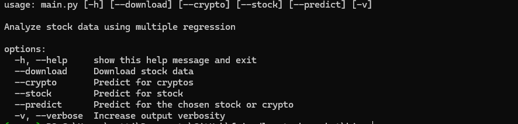

# friendly-stock-market

## Description

## Requirements

python >= 3.8

**Setting Up the Environment**

* Windows: `./setup_Windows.bat`
* Linux/macOS: `./setup_Linux.sh`

These scripts will install required dependencies, and build a virtual environment for you if you don't have one.

## Running the Program (CLI or GUI)

### CLI

1. Navigate to the `bin` directory: `cd bin`

2. Execute `python main.py [--help]` (use `python3` on Linux/macOS) in your terminal

    The `--help` flag displays available command-line arguments.

## Author

Neetre 2024
